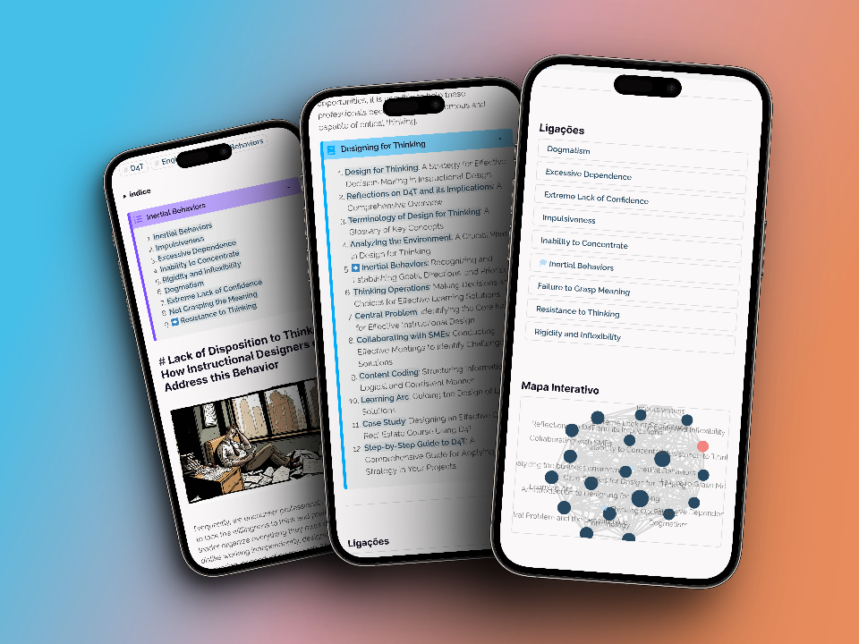
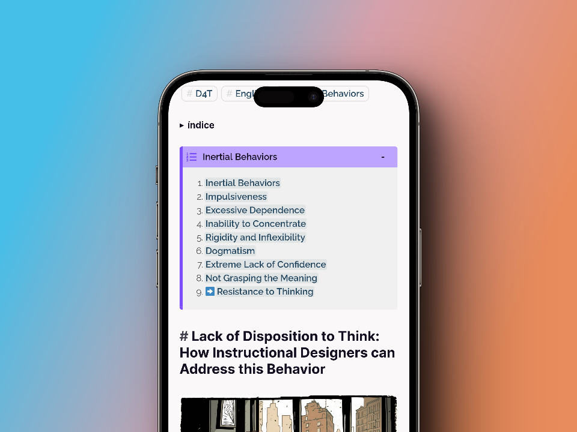
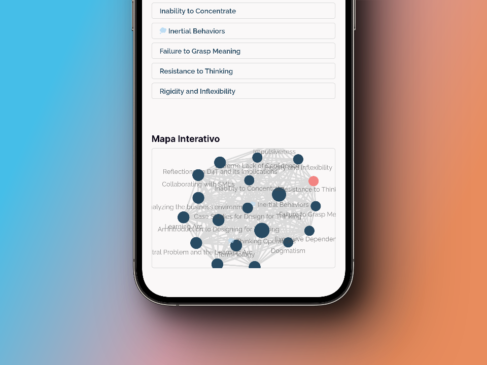
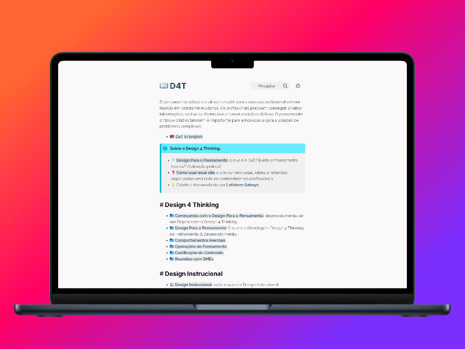


The main goal of the website is to disseminate new ideas and serve as a repository of information about instructional design in Portuguese. The website should allow easy access and navigation of information, as well as present content in an organic and interconnected way.


 
- **Objective**: To disseminate ideas and information about instructional design.
- **Target audience**: Educators, instructional designers, students, researchers, etc.
- **Structure**: Organized into categories and subcategories related to the theme.
- **Format**: Digital Garden, with interconnected content.
- **Platform**: Website developed with Hugo.
- **Language**: Portuguese and English.
 - Tools
  - **Hugo**: To build and manage the website.
  - **Markdown**: To write and format website content.
  - **Git**: For version control and collaboration.
  - **GitHub**: For website hosting.
  - **Visual Studio Code**: Source code editor to write and edit code files.
  - **Canva**: To create graphics and images for the website, such as banners, thumbnails, infographics, etc.
  - **Slack**: For real-time communication and collaboration with the team.
  - **Google Docs**: For collaboration on documents and content planning.
  - **Feedly**: To follow relevant blogs and websites and stay up-to-date with the latest trends and research in instructional design.



[Visit the site](https://d4t.dev)

Digital gardens are a way of sharing knowledge and inspiration, promoting continuous learning, critical thinking, and curiosity. Moreover, they encourage collaboration and exchange of ideas among individuals, creating a dynamic and enriching learning environment.

### 1.1. Main Objective:

The main goal of the website is to serve as a platform for sharing theories, ideas, and knowledge about instructional design, as well as being a repository of useful information for those seeking to learn or enhance their skills in this area. The website should offer a pleasant and interactive user experience, encouraging exploration and the discovery of new concepts and connections.

As instructional design is a constantly evolving field, it is important to stay up-to-date with the latest trends and research. Often, these trends and research are presented at international conferences, academic publications in English, and other materials that are not easily accessible to instructional design professionals in Brazil.

Moreover, the translation of these materials can also enable greater international collaboration and exchange of ideas and practices with other instructional design professionals around the world. This can enrich practice and bring new perspectives and solutions to challenges in the field.

By translating these contents, we are also contributing to the building of a more inclusive and accessible instructional design community, allowing more professionals to have access to the information and knowledge necessary to enhance their practices and drive the advancement of the field in Brazil.

### 1.2. Target Audience:

The target audience of the website are educators, instructional designers, students, researchers, and other professionals interested in instructional design. Understanding the needs and expectations of the target audience will help shape the content and structure of the website.

### 1.3. Content Scope:

The content scope to be included on the website should involve identifying topics and subareas within instructional design that face difficulties in incorporation into the professional development of Brazilian instructional designers. These gaps exist for a variety of reasons, including language barriers, resource limitations, lack of incentive, limited access to information, and implementation difficulties.

To overcome these barriers, it is important to invest in training programs and encourage constant practice updates, as well as ensure access to necessary information and resources to incorporate new research and trends in instructional design practice, with special focus on the following areas:

- Learning theories and pedagogical models
- Teaching strategies and techniques
- Course design and planning
- Assessment and feedback
- Educational technology and teaching tools
- Trends and innovations in instructional design
- Case studies and practical examples

The lack of agility in incorporating international research into the professional development of Brazilian instructional designers may have several reasons. Some of them may include:

1. Language barrier: As many instructional design research and academic publications are in English, this may be a barrier for many professionals in Brazil who do not speak the language. This can limit access to important information and delay the incorporation of new research and trends.
2. Resource limitations: Instructional design professionals in Brazil may face resource limitations, such as lack of access to materials and technologies necessary to implement new practices and trends.
3. Lack of incentive: Often, the lack of incentive from educational institutions and companies can be a barrier to the incorporation of new research and trends. If institutions do not value updating and constantly improving instructional design practice, this may discourage professionals from investing time and resources in incorporating this research.
4. Limited access to information: Limited access to information may be another reason for the lack of agility in incorporating international research into the professional development of Brazilian instructional designers. This may include a lack of access to international conferences, academic publications, and other important sources of information.
5. Implementation difficulties: Some new instructional design research and trends may be difficult to implement in practice, which can delay the incorporation of this research by professionals in Brazil.

### 1.4. Structure and Navigation:

The overall structure of the website and content will be organized to facilitate navigation and discovery. To do this, we had to think about how to categorize and connect information in an organic and interconnected way, so that users can easily explore the content and follow their own learning path. We decided to use categories, tags, backlinks, and other navigation mechanisms.



### 1.5. Timeline and Resources:

We needed to establish a realistic timeline for the development and launch of the website, considering aspects such as research, design, development, deployment, and promotion. We also identified the resources needed for the project, such as tools, collaborators, and budget.

By defining the objective and scope of the project from the beginning, we tried to establish a solid foundation for the development of a successful instructional design-focused digital garden website. This also helped guide future decisions related to the design, content, and functionalities of the website.

## 2. Content Structure:

When creating a digital garden website focused on instructional design, it is essential to structure the content appropriately to facilitate navigation and discovery, as well as promote organic connection between ideas and information. Here is a detailed description of this process.

### 2.1. Categories and subcategories:

Organize the content into categories and subcategories related to instructional design, so that visitors can easily identify and access relevant information. Some potential categories and subcategories include:

- Learning theories: Behaviorism, Cognitivism, Constructivism, Connectivism.
- Methodologies: Direct instruction, Project-based learning, Flipped classroom, Hybrid classroom.
- Tools: Learning management systems (LMS), Virtual learning environments (VLE), Authoring tools, Collaboration tools.
- Case studies: Success stories, Lessons learned, Comparative studies.
- Trends: Personalized learning, Microlearning, Competency-based learning, Virtual and augmented reality.
- Resources: Books, articles, courses, events, blogs and related websites.

### 2.2. Index pages:

For each category and subcategory, there will be an index page that lists the related content. These index pages should serve as entry points for visitors to explore topics in more detail. We consider adding visual resources, such as graphics and images, to make the pages more attractive and informative, always with a focus on ease of learning.

### 2.3. Tags and connections:

We use tags to connect and interrelate content from different categories and subcategories. For example, an article on the application of constructivist theory in an online learning environment can be tagged with "Constructivism" and "Virtual learning environments". This facilitates the discovery of related content and helps visitors establish connections between ideas and information.

### 2.4. Backlinks and references:

We incorporate backlinks and references throughout the content, so that visitors can follow links to explore related topics and deepen their knowledge. This promotes organic interconnection between ideas and allows visitors to follow their own learning path through the digital garden.


### 2.5. Evolving content:

A digital garden is a space in constant evolution. By adding and updating content, we continue to refine and adjust the structure of the site to accommodate new information and connections. When necessary, we can use a version control system such as Git to track changes and collaborate with other contributors.

### 2.6. Notation and reflection blocks:

We try to include notation and reflection blocks throughout the content to share ideas, thoughts, and experiences related to instructional design. This humanizes the content and helps establish an emotional connection with visitors, as well as demonstrate that the digital garden is a space for continuous learning and growth.

### 2.7. Non-linear navigation:

We encourage non-linear navigation through the content, allowing visitors to explore the digital garden according to their interests and needs. We include a visual site map, a knowledge graph visualization that shows connections between topics and helps visitors navigate the content.

## 3. Site structure

### 3.1. Homepage

While Markdown is a lightweight and easy-to-use markup language, it has limitations in terms of design and functionality, especially when creating a landing page that requires more advanced web design features.

This is a simplified version of a Markdown landing page, with sections and links to the categories and subcategories mentioned earlier, as well as links to the latest articles and an image representing the web of connections between content. To capture the user's attention, the page includes a clear description of the purpose of the site and an invitation to explore related content.

Creating secondary landing pages or index pages can be useful for delving deeper into each topic and providing easier and organized navigation. However, it is important to remember that this Markdown implementation does not offer all the design and interactivity possibilities found in a complete HTML, CSS, and JavaScript-based solution.

```markdown
# Digital Instructional Design Garden 🌿📚

**Explore** a world of evidence-based information and fresh ideas to enrich your educational practices and strategies.

## 🌟 What to expect in our Digital Garden

1. [Learning Theories](learning-theories.md)
2. [Innovative Methodologies](methodologies.md)
3. [Technological Tools](tools.md)
4. [Inspiring Case Studies](case-studies.md)
5. [Emerging Trends](trends.md)
6. [Valuable Resources](resources.md)

## 🌱 Cultivate your knowledge with our latest articles

- [Debunking Learning Myths](debunking-myths.md)
- [Instructional Design and Gamification](gamification.md)
- [Artificial Intelligence in Education](artificial-intelligence.md)

## 🔍 Discover the connections in our Garden

[](garden-map.md)

Navigate through our interactive map of the Digital Garden and explore the connections between different topics and contents.

## 💌 Stay up to date

Receive updates on new content, events, and resources first-hand. Subscribe to our newsletter and connect with our Digital Garden.

[Subscribe to Newsletter](newsletter.md)

## 💡 Get in touch

Have a question, suggestion, or want to contribute to our Digital Garden? We'd love to hear from you.

[Contact us](contact.md)
```

This Markdown landing page version aims to be more creative, including emojis to add a visual and friendly touch to the page. The sections and links were organized slightly differently to improve readability. The description of the purpose of the site and the invitations to explore related content remain, and the interactive map is presented as a way to encourage exploration of the connections between topics.

### 3.2. Directory Organization

Next, we needed to define a directory structure for the content of the Jardim Digital de Design Instrucional website. In this structure, each category has its own folder with an `_index.md` file that serves as the category's main page. The Markdown files within each folder represent individual pages for topics related to the category. Additionally, there are folders for the "About," "Contact," "Newsletter," and "Map of the Garden" pages, which also have `_index.md` files.

```md
/content
|-- learning-theories
|   |-- _index.md
|   |-- behaviorism.md
|   |-- cognitivism.md
|   |-- constructivism.md
|   |-- connectivism.md
|-- methodologies
|   |-- _index.md
|   |-- flipped-learning.md
|   |-- project-based-learning.md
|   |-- collaborative-learning.md
|-- tools
|   |-- _index.md
|   |-- LMS-platforms.md
|   |-- authoring-tools.md
|   |-- educational-apps.md
|-- case-studies
|   |-- _index.md
|   |-- gamification-in-higher-education.md
|   |-- artificial-intelligence-in-education.md
|-- trends
|   |-- _index.md
|   |-- adaptive-learning.md
|   |-- microlearning.md
|   |-- mobile-learning.md
|-- resources
|   |-- _index.md
|   |-- books.md
|   |-- articles.md
|   |-- courses.md
|-- about
|   |-- _index.md
|-- contact
|   |-- _index.md
|-- newsletter
|   |-- _index.md
|-- map-of-the-garden
|   |-- _index.md
```

## 4. Content Creation

Considering the need to keep the content updated and evidence-based, as well as ensuring that the latest information is accessible to professionals, here is the detailed strategy for creating content for the website:

1. **Monitoring relevant sources**: Stay up-to-date with the latest research and findings in instructional design by monitoring academic publications, blogs, podcasts, conferences, and other relevant resources. Give preference to trusted and respected sources in the field.
2. **Establish partnerships with experts and institutions**: Connect with experts, academics, and research institutions involved in the field of instructional design. This can help you access up-to-date information and research, as well as collaborate on content creation and review.
3. **Translation and adaptation of content**: To make information more accessible to Brazilian professionals, translate and adapt relevant content from English to Portuguese. Ensure that translations are accurate and of high quality and, when necessary, adapt examples and contexts to reflect local reality.
4. **Creation of original content**: Develop original content addressing relevant topics for instructional design in the Brazilian context. This may include local case studies, analyses of educational policies, interviews with local experts and professionals, among others.
5. **Regular review and updating of content**: Establish a schedule to regularly review and update website content. This will ensure that information is accurate and reflects the latest findings and practices. Include information about the date of the last update, so that visitors know how current the content is.
6. **Inclusion of references and sources**: When creating content, include references and links to the original sources of cited information and research. This will allow visitors to access and verify information for themselves and explore topics in greater depth.
7. **Facilitating community feedback and contribution**: Encourage visitors to provide feedback and contribute to website content. This may include soliciting suggestions, corrections, and updates, as well as creating opportunities for visitors to share their own experiences and knowledge.
8. **Promoting collaboration and information sharing**: Establish a space on the website for the community of Brazilian instructional design professionals to connect, share resources, and discuss evidence-based ideas and practices. This may include a discussion forum, email list, or social media platform.
9. **Establishing a publishing schedule**: To keep website content up-to-date and engage visitors, establish a regular publishing schedule for new articles, resources, and updates. This may include, for example, publishing a new article every week or biweekly.
10. **Promoting content**: To increase the reach and impact of website content, develop strategies for promoting it to relevant professionals and institutions. This may include using social media, newsletters, partnerships with organizations, and participation in events and conferences.
11. **Evaluating the impact of content**: Monitor and evaluate the impact of website content, using metrics such as page views, shares, comments, and visitor feedback. Use this information to refine your content creation strategy and ensure that you are meeting the needs and interests of your target audience.
12. **Continuous training and development**: Invest in your own training and professional development by participating in courses, workshops, conferences, and other learning opportunities. This will help ensure that you are up-to-date with the latest trends and practices in the field of instructional design and able to apply them to website content.

By following this detailed strategy, we believe the website will be a valuable resource for educators, instructional designers, students, researchers, and other professionals interested in instructional design in Brazil. By focusing on evidence-based information and local relevance, the website aims to contribute to the development and dissemination of effective practices in the field of instructional design, benefiting both professionals and students.




## 5. Tools

These tools and software may vary depending on the specific needs of the project, team, and workflow. It is important to choose the tools that best fit your needs and allow for efficient collaboration and workflow.

| Tool              | Description                                                           |
|-------------------|-----------------------------------------------------------------------|
| Hugo              | For building and managing the site                                     |
| Markdown          | For writing and formatting the site's content                          |
| Git               | For version control and collaboration                                  |
| GitHub or Netlify | For hosting the site                                                   |
| Visual Studio Code| Source code editor for writing and editing code files                  |
| Google Analytics  | For tracking and analyzing site traffic                                |
| SEO tools         | Tools like Moz, SEMRush, or Google Search Console for SEO               |
| Trello or Asana   | For project management and task organization                           |
| Canva             | For creating graphics and images for the site, such as banners, thumbnails, infographics, etc. |
| Slack or Discord  | For real-time communication and collaboration with the team            |
| Google Docs       | For collaborating on documents and content planning                    |
| Feedly            | For keeping up with relevant blogs and sites and staying up-to-date with the latest trends and research in instructional design. |

