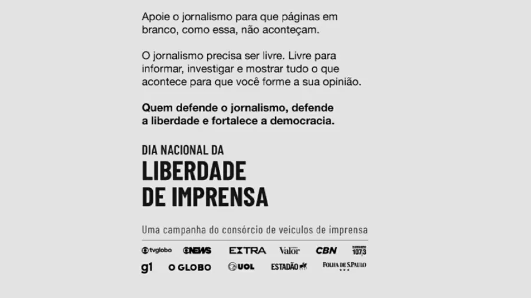

O Brasil comemora, nesta terça-feira (7), o Dia Nacional da Liberdade de Imprensa. E, para reafirmar a importância da data, o consórcio de veículos de imprensa se uniu em uma ação que reforça a importância do acesso à informação de qualidade pela sociedade, já que sem informação não há cidadania plena.

Isaac Asimov já foi cruel ao perguntar "Por favor, o direto de saber o quê?" (no belo artigo *"Um culto da ignorância"*, [que eu traduzi aqui](https://llsaboya.com/p/traducao-de-um-culto-da-ignorancia-por-isaac-asimov/)). A imprensa brasileira já não é reconhecida pela qualidade faz muito tempo.

Quando era criança, meu tio Arthur e eu passávamos certas manhãs procurando erros de português nos jornais - já que eram raros - e tentávamos tirar alguma conclusão disso. Quer um exercício melhor de falácia *post hoc ergo propter hoc* (“depois disto, portanto por causa disso”, em latim)? Entretanto, era inegável para mim (e ainda é) a direta relação entre erros de português e a qualidade das matérias nos jornais.

Como todos os jornais aderiram ao novo acordo ortográfico, e hoje contratam eternos estagiários que não sabem escrever, e não valorizam bons profissionais (clássicos ou ainda a estrearem, assim como eu), e tem obsessão com agilidade na divulgação em detrimento do devido trabalho jornalístico, só posso chegar a uma conclusão *post hoc ergo propter hoc*: hoje todos não prestam.

## Uma campanha em defesa do jornalismo profissional

O fato de mentirem até mesmo na própria campanha piora ainda mais minha impressão.

>Ao clicar no anúncio, será exibida uma página em branco acompanhada da seguinte explicação: "Apoie o jornalismo para que páginas em branco, como essa, não aconteçam. O jornalismo precisa ser livre. Livre para informar, investigar e mostrar tudo o que acontece para que você forme a sua opinião. Quem defende o jornalismo defende a liberdade e fortalece a democracia" - [UOL](https://economia.uol.com.br/noticias/redacao/2022/06/07/liberdade-de-imprensa.htm)

Ao clicar no link chegamos sempre a uma página explicando a ação, não no anúncio. Talvez isso mude até o fim do dia - e se mudar mostra como a imprensa se comporta atualmente. Faz uma chamada para fisgar o leitor, mas não entrega o prometido.

A internet fez o jornalismo mudar. Hoje temos o "jornalismo" e o "jornalismo profissional". Entender a distinção é difícil porque cada veículo tem sua definição de profissionalismo. O jornal mais rápido em divulgar uma notícia? O veículo com a melhor análise dos principais eventos? A publicação mais ética do mercado? Profissionais que buscam a verdade dos fatos? O jornal que concorda com a sua verdade?

Tanto faz como um jornalista se define. Jornalistas sabem que hoje, no final de todas as contas, eles não importam. O importante é o **leitor**. Essa realidade é cruel com os profissionais do jornalismo.

Ou o jornalista entrega o que o jornal quer, ou ele não tem emprego. E ir fundo nos fatos não é prioridade para o jornalismo profissional.

As páginas principais do consórcio de veículos de imprensa estão cheias de matérias sobre a difícil vida das celebridades, de importantes dicas para a sua saúde, as últimas fofocas da televisão e as últimas barbaridades cometidas pela humanidade.

Também há diversos artigos escritos por personalidades reconhecidamente sem experiência alguma sobre os temas que escrevem. Aliás, não precisam nem escrever, muito menos escrever bem, apenas atrair **leitores**. Todos temos direito a nossas opiniões, mas o "jornalismo profissional" manda uma mensagem clara quando valoriza a popularidade ao invés da propriedade: o que nos interessa é apenas **repercutir** porque é isso que paga as contas!

E pagar as contas é o mais importante para o jornalismo profissional.

## Marketing & Jornalismo: um casal perfeito

Antigamente o jornalismo precisava de dois alicerces: **leitores e publicidade**. A qualidade do material jornalístico garantia os leitores e suas assinaturas. Com leitores, você garantia a publicidade e seus contratos. Conta paga!

A internet destruiu essa dinâmica. Hoje você não precisa pagar nada para saber o que acontece no mundo. Então, para que assinar um jornal, não é mesmo? A aversão a assinaturas dos internautas causou um problemão para o jornalismo: sem leitores, como cobrar pela publicidade?

A publicidade também sofreu porque, sem os leitores, atingir um público-alvo ficou difícil. Não se engane com as histórias de anúncios personalizados. Isso não existe. A publicidade e o marketing entraram para o jogo de números. Esqueçam a qualidade do público-alvo, o importante agora é a **quantidade de pessoas**, a única métrica concreta na internet.

A solução para o jornalismo foi ganhar visualizações a qualquer preço. Celebridades estão nos jornais para aumentar as visualizações. O fluxo de matérias superficiais estão lá para ganhar *views*. Novas matérias, novos leitores.

Hoje nenhum jornal mantém uma matéria por mais de um dia em sua página principal.

Eu pensei que levaria uma hora para escrever esse texto. Provavelmente vai levar o dia todo. Isso não é rápido o suficiente para o jornalismo profissional. A maioria dos meus *views* nem chegarão a esse parágrafo. Eu não me importo com isso, mas o jornalismo profissional sim.

Ser simplório e raso acabou com o jornalismo profissional. Por isso agora temos jornalismo para todos os gostos e crendices na internet. Não importa o que você pensa sobre política, esportes, entretenimento ou filosofia. Por pior que seja a capacidade de raciocinar de um indivíduo, com certeza tem um site pronto para ganhar dinheiro com ele.

Talvez aí esteja a verdadeira diferença que o jornalista profissional acredita ter: o profissional não se vende como um taxi - ele está mais para um Uber.

## Quais dificuldades, afinal?

Então chegamos à pergunta incomoda do Asimov, **temos o direito de saber o quê?** O UOL, Folha de S.Paulo, TV Globo, GloboNews, g1, O Globo, Extra, Valor Econômico, Estadão, CBN e Rádio Eldorado não tem grandes problemas para fazer jornalismo. Eles têm dinheiro, poder e influência para apurar qualquer matéria.

Trabalhar em um grande veículo de comunicação sempre terá glamoures, eu sei, mas a internet mostrou que nem todos os chamados profissionais da imprensa **não são competentes para fazer um bom trabalho**. Se antes era raro achar erros nos grandes jornais, hoje é lugar comum. As páginas da web tornam fácil acertar um erro de concordância, a flexão verbal, ou o artigo inteiro (quando é o caso).

Mesmo que a internet seja a casa de diversos bons profissionais, gente que sabe ler e escrever descentemente, nenhum deles é capaz de ser um antagonista para o jornalismo profissional - e a [turma do Diogo Mainardi prova isso](https://llsaboya.com/p/revista-crusoe-contra-site-antagonista/) sendo apenas uma ilha (e eles não me convidaram para essa festa pobre - ninguém quer nem me convencer).

Ter uma televisão ainda é uma concessão pública. Papel para imprimir jornal ainda é muito caro (isso se ainda existisse bancas para vender seu impresso). Ninguém se importa mais em ler. Onde você acha alguém que escreve bem?

Se essas condições para uma verdadeira concorrência não existem, **por que diabos os jornalistas profissionais estão preocupados?**

## Que você forme sua opinião nos visualizando

Há uma guerra por atenção na internet. O jornalismo profissional está em guerra com o TikTok.  Os *Homers Simpsons* ([como chama o Willian Bonner](https://www1.folha.uol.com.br/folha/ilustrada/ult90u55778.shtml)) preferem os gurus da esquerda ou da direita no Facebook. O jornalismo profissional prefere as celebridades aos bons ensaístas. A maioria das pessoas não gosta de ler.

Já os bons leitores (aqueles que assinariam um jornal) migram aos poucos para o jornalismo independente (aquele sem partido de estimação e perigosos para o marketing das marcas famosas e inclusivas).

Então o jornalismo profissional resolveu dar uma carteirada, "Você sabe com quem estão falando? Nós somos a autoridade. Nós somos jornalistas profissionais!" Ao contrário de todo o resto de nós, escritores, críticos, entusiastas, eles têm uma carteirinha para chamar de sua e toda a autoridade para nos ajudar a formar nossa opinião.

Se nossa liberdade está em perigo, devemos agradecer ao jornalismo profissional. Muito obrigado! Sem vocês nunca entenderia que minha ignorância é tão boa quanto o seu conhecimento. Mas abusado como eu sou, ainda faço a mesma pergunta do Isaac Asimov:

"Eu tenho o direito de saber o quê? Porque com o jornalismo profissional eu só sei de forma vaga  _o que está acontecendo por aí_..."

PS: Só para constar, agora sou eu que caço erros de português com meu filho, Arthur - inclusive no Youtube.