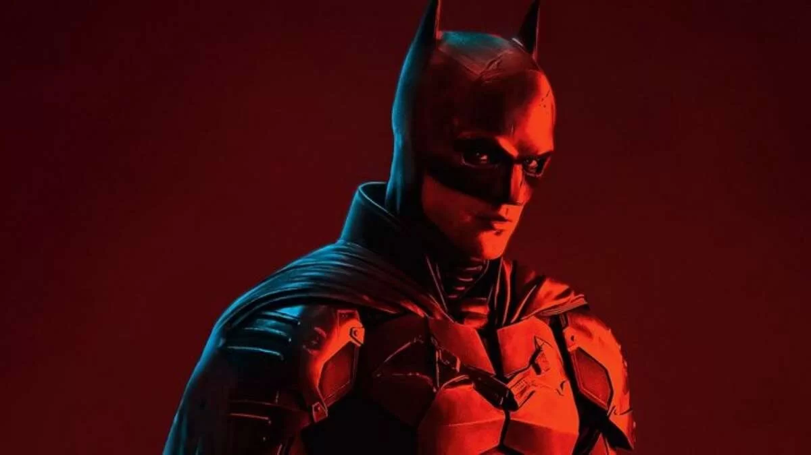
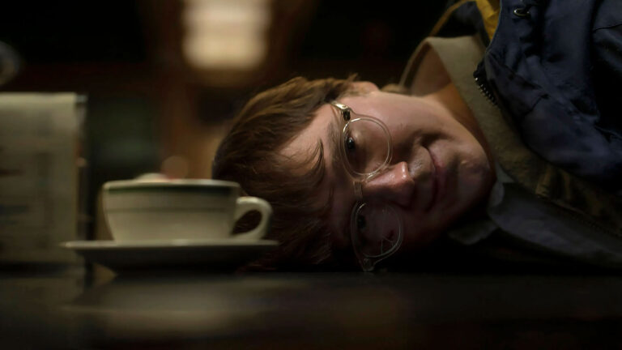
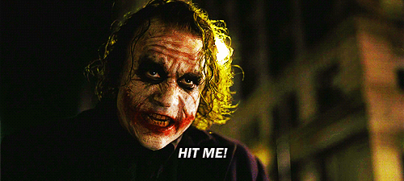
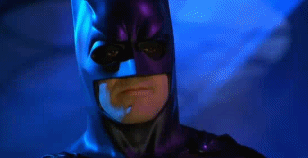

Imagine que você é uma criança que testemunhou seu pai e sua mãe serem mortos por absolutamente nada, vítimas de um criminoso qualquer na saída do cinema. Imagine a desolação, o medo e a dor de não ter mais seus pais, ter pesadelos com o assassinato, se culpar por ter escolhido ver esse filme, não ter mais parentes próximos e não saber como será a sua vida daqui para frente.

Apensar de você possuir todo o dinheiro do mundo, dentro desse sofrimento, conforme você cresce, vê a raiva, o desespero e a culpa te consumir por dentro enquanto você se esforça manter as boas memórias e lições que seus pais passaram nesse curto tempo de vida - ainda que nada disso fez a diferença.

Apensar de você possuir todo o dinheiro do mundo, a realidade é: ambos estão mortos e ninguém no mundo se preocupa com caráter, honestidade ou bondade, apenas com dinheiro, lucro e poder. Nada pode trazer seus pais de volta.

O que você faria?

De acordo com o diretor Matt Reeves e o filme Batman (2022), você vira o Kurt Cobain.

## As origens de Kurt Cobain e Bruce Wayne

Bruce Wayne, de Robert Pattinson, é parcialmente inspirado por Kurt Cobain. O roteirista e diretor Matt Reeves disse que estava ouvindo o Nirvana quando escreveu o primeiro ato com Pattinson em mente.

>"Foi quando imaginei que, em vez de fazer de Bruce Wayne a versão playboy que vimos antes, há outra versão que passou por uma grande tragédia e se tornou um recluso. Kurt Cobain tinha um relacionamento com a fama, onde ser famoso não era seu objetivo. Ele adorava música, mas a idéia de ser famoso pela música era uma espada de dois gumes para ele. E isso me fez pensar em Rob Pattinson, na verdade. Eu senti que essa vibração de estrela do rock combinava bem com ele. Afinal, ele se tornou um ícone da cultura pop em uma idade muito jovem e teve que carregar esse fardo também, e se livrar dele para se tornar o ator que ele é hoje."

Para compreender a linha de raciocínio que levou Reeves a fazer o pior Batman de todos os tempos (e pensei ser impossível fazer algo pior do que Batman Eternamente) é preciso conhecer a infância de Kurt Cobain.

Em resumo, o dono do Nirvana é filho de uma enfermeira e de um mecânico, típico garoto nascido na classe média americana. Quando Cobain tinha nove anos uma tragédia aconteceu, seus pais se divorciaram. Provavelmente brigas, drogas ou traições? Claro que não, foi algo ainda pior: a queixa da mãe de Kurt era que o marido estava o tempo todo envolvido em esportes.

A história familiar de Kurt é uma tragédia, do começo ao fim. Uma coleção de decisões um tanto burras (pra dizer o mínimo) de todos os envolvidos que culminou no grunge e no suicídio de Kurt. É preciso ser um gênio para combinar esse *triangulo amoroso* - Kurt, Pattinson e Bruce Wayne - e gênio não é um adjetivo relacionado com Matt Reeves.

Reeves é amiguíssimo de JJ Abrams, portanto é preciso subverter as expectativas do público. Subverter expectativas com o Batman é difícil. Ele já foi samurai, ciborgue, malvado, louco, triste, alegre, alto, baixo, legal, rabugento - ele até mesmo já teve um cartão de crédito black personalizado!

Até então as duas características preservadas nessas histórias malucas foram: primeiro, ele é um detetive competente e dedicado e, segundo, Thomas e Martha Wayne são pais exemplares e dedicados.

Em Batman (2022) Bruce Wayne é um detetive incompetente, Martha Wayne uma maluca e Thomas Wayne um assassino.

## O Batman CEO

O antagonista do filme é o *Charada*. Mantenha isso na sua mente.

O metódico trabalho investigativo é principal arma do Cavaleiro das Trevas. Usar a teatralidade e o medo para quebrar a cara dos bandidos seria impossível sem uma boa investigação. A atenção aos detalhes, perspicácia e resiliência de Bruce Wayne serve para suas duas vidas, a de dono de corporação e a de vigilante mascarado.

Nos quadrinhos clássicos, Bruce Wayne pode delegar autoridades na sua vida civil, afinal grandes empresas precisam de diversas pessoas para funcionar no dia a dia. Entretanto, o trabalho de vigilante de Gotham City não podia ser delegado: a cidade exige do Batman sua totalidade.

Pra subverter expectativas, Matt Reeves transforma o homem-morcego num **CEO de Startup**. Jovem, voluntarioso e obsessivo, Batman não é capaz de apreender nada. Ele está sempre atormentado pelo peso da sua responsabilidade, faz observações óbvias, é facilmente manipulado e tem demasiado apego pelos seus *gadgets*.

Por exemplo, Charada, o vilão, deixa mensagens enigmáticas em cartões nas cenas do crime. Seriam enigmas engenhosos como os criptogramas indecifráveis do Assassino do Zodíaco (uma das inspirações ~~plágios~~ de Reeves)?

Não. Charada apenas trocou as letras por símbolos no jogo de **advinhas**. Minha irmã era mais esperta do que isso quando criptografava seus diários. Esse cara aí embaixo explica como é fácil é decifrar esses códigos:



E é assim que Batman, o CEO, vai até o fim do filme. Ele não resolve absolutamente nada, sempre são os outros personagens que salvam o dia.

Um criptograma mais complicado? Que nada, é apenas uma *inconveniência*: o mordomo, Alfred, foi um espião inglês e resolve com facilidade.

A arma do crime é um objeto peculiar que ninguém sabe o que é? E descobrir esse segredo vai permitir Batman a buscar a verdade e, depois de superar seus próprios demônios, vencer o vilão da história?

Claro que sim! Oras, sempre há um policial por aí que, filho de um antigo tapeceiro, sabe o que é um esticador de carpete (*carpet tucker*) e assim descobre que todo o plano do inimigo está escrito no chão! Isso é muito analógico, uma homenagem às histórias em quadrinhos.

Não é o caso do Charada ser alguém capaz de criar um plano secreto no computador nessa nova era digital, não é mesmo?

## O filme mais sombrio de todos os Batman

Admito que o Batman de Matt Reeves consegue ser mais sombrio que o de Tim Burton. Aliás, se você não aumentar o brilho da tela no máximo, não enxerga o que passa. Além disso abusa do vermelho. Muito vermelho. Não é vermelho sangue.

Ninguém sangra. Batman pula de cima de um prédio, cai em cima de um ônibus, bate de cara no chão e está tudo bem - afinal, ele acabara de sobreviver a uma bomba que explodiu (literalmente) no seu peito.

Curiosidade, a cena do ônibus foi filmada na mesma rua de Chicago onde filmaram Cavaleiro das Trevas.

Se7en é sobre dois detetives da homicídios (Morgan Freeman e Brad Pitt) que desesperadamente caçam um assassino em série que justifica seus crimes como uma ferramenta para acabar com a ignorância mundial dos Sete Pecados Capitais.

David Fincher (o diretor de Se7en) disse a Kevin Spacey e Brad Pitt que "este não será o filme pelo que você é lembrado, mas pode ser um filme do que você está incrivelmente orgulhoso".

Alguém disse isso para Robert Pattinson na época do Crepúsculo. Ele acredita nessas coisas até hoje.

## Os setes pecados capitais

Em 1273, a Suma Teológica de São Tomás de Aquino fez a revisão dos pecados listados pelo Papa Gregório e os classificou novamente. Tal reclassificação resultou na lista dos atuais sete pecados capitais: luxúria, soberba (vaidade), preguiça, inveja, gula, avareza e ira (raiva). Antes também tinha a vanglória (vaidade), a acídia (uma história para outro texto), a tristeza - é uma lista dinâmica.

Batman (2022) fez a revisão do personagem e usou todos esses pecados para produzir o filme (e deve ter inventado outros novos, talvez).

Muitos críticos que respeito (e alguns amigos com bom gosto) elogiaram esse filme - só não entendo como puderam fazer isso. A densidade desse roteiro é a mesma de Batman & Robin. Até mesmo as absurdas cenas de ação.

Batman é um personagem explorado a exaustão. Já foi alívio cômico, já foi samurai, já viajou para o passado e o futuro, é um dos melhores personagens LEGO. Qualquer personagem dos quadrinhos já tem uma história boa, estruturada, densa e muito bem executada no papel. Cineastas não deveriam se achar melhores, ou mais imaginativos, do que os artistas dos quadrinhos. Não são, e deveriam aprender e crescer com a experiência de levar às telonas esses personagens.

Entretanto, em cinema, os pecados capitais são a regra.

Aqueles que elogiaram o filme talvez o assistam com outros olhos depois de ler esse texto. Assim espero. [Boas histórias não podem morrer](https://llsaboya.com/p/porque-tolkien-tem-morrer/). E espero que você tenha aprendido alguma coisa hoje.